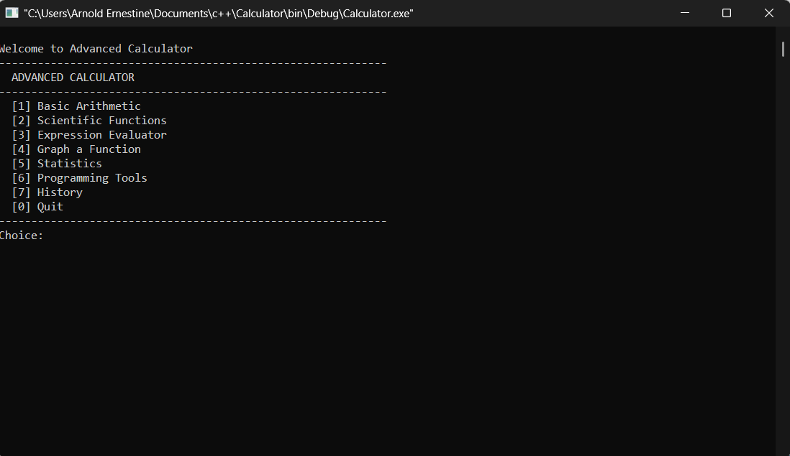

# C++ Console Calculator

A stateful command-line calculator written in C++ that supports basic arithmetic, percentage, chained operations, and a running history of the last 5 calculations.

---

## Features

- Addition (`+`), subtraction (`-`), multiplication (`*`), division (`/`)
- Percentage conversion (`%`)
- Chained calculations without re-entering previous results
- History of last 5 operations displayed on each step
- Clear (`c`) and quit (`q`) commands
- Division by zero protection

---

## Screenshots




> Add your terminal screenshots here

<!-- Example:

-->

---

## Requirements

- C++ compiler — `g++` (MinGW on Windows, GCC on Linux/Mac)
- Terminal or Command Prompt

---

## How to Compile

```bash
g++ calculator.cpp -o calculator
```

## How to Run

**Linux / Mac:**
```bash
./calculator
```

**Windows:**
```bash
calculator.exe
```

---

## Usage Example

```
Calculator — operators: + - * /  |  % = percent  |  c = clear  |  q = quit

Enter number: 10
Enter operator (+ - * /) or = to evaluate: *
Enter number: 5
Enter operator (+ - * /) or = to evaluate: =
Result: 50

Enter number: 50
Enter operator (+ - * /) or = to evaluate: %
Result: 0.5
```

### Commands

| Input | Action |
|---|---|
| `+` `-` `*` `/` | Arithmetic operators |
| `=` | Evaluate and show result |
| `%` | Convert current number to percentage |
| `c` | Clear all values |
| `q` | Quit the program |

---

## OSI Model — Which Layers This App Operates On

| Layer | Name | Role in this app |
|---|---|---|
| 7 | Application | All calculator logic runs here |

The C++ console calculator runs entirely locally — no networking, no internet connection required. It operates **only at Layer 7 (Application Layer)** of the OSI model. There is no involvement of Layers 1–6 because no data is transmitted across any network.

---

## File Structure

```
calculator-app/
├── calculator.cpp    # Full source code
└── README-cpp.md     # This file
```

---

## Related

- [Web Calculator App](./calculator-web-app/README.md) — React version with animated UI
