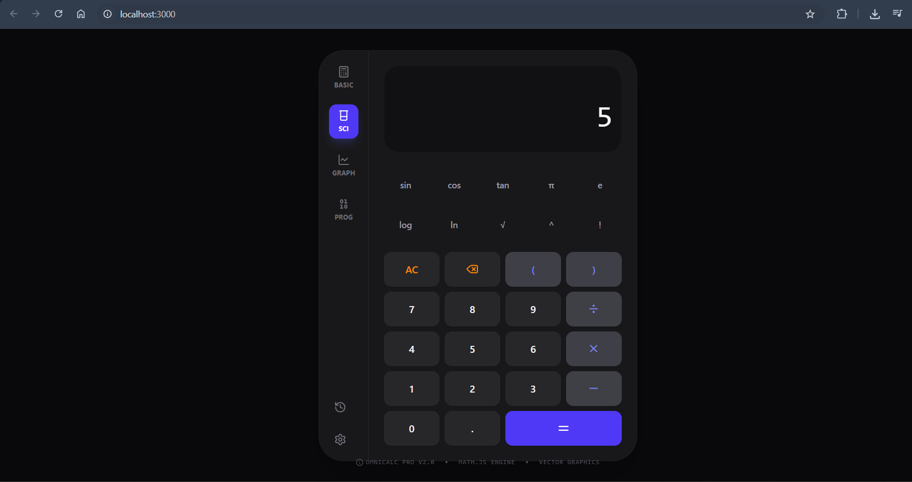

<div align="center">


# Web Calculator App

A fully functional, animated calculator built with React, TypeScript, and Tailwind CSS — prototyped using Google AI Studio.

</div>

---

## Features

- Addition, subtraction, multiplication, and division
- Percentage calculation
- Decimal number support
- Calculation history (last 5 operations)
- Keyboard input support
- Animated UI with smooth button interactions
- Divide-by-zero protection

---

## Screenshots



> Add your screenshots here after capturing them

<!-- Example:


-->

---

## Tech Stack

| Technology | Purpose |
|---|---|
| React + TypeScript | UI framework and type safety |
| Tailwind CSS | Styling |
| Framer Motion | Button and transition animations |
| Vite | Build tool and dev server |
| Google AI Studio | Initial prototyping and generation |

---

## Run Locally

**Prerequisites:** Node.js (v18 or later)

1. Clone the repository:
```bash
git clone https://github.com/Arnold-ernest/calculator-app.git
cd calculator-app/calculator-web-app
```

2. Install dependencies:
```bash
npm install
```

3. Add your Gemini API key — create a `.env.local` file:
```
GEMINI_API_KEY=your_key_here
```

4. Start the development server:
```bash
npm run dev
```

5. Open your browser at `http://localhost:5173`

---

## Deploy to GitHub Pages

1. Install the deployment package:
```bash
npm install gh-pages --save-dev
```

2. Add to `package.json`:
```json
"homepage": "https://Arnold-ernest.github.io/calculator-app",
"scripts": {
  "predeploy": "npm run build",
  "deploy": "gh-pages -d dist"
}
```

3. Deploy:
```bash
npm run deploy
```

---

## OSI Model — Which Layers This App Operates On

| Layer | Name | Role in this app |
|---|---|---|
| 7 | Application | React UI, calculator logic, HTTP requests |
| 4 | Transport | TCP connection handling (HTTPS) |
| 3 | Network | IP routing between client and server |

The web app communicates over the internet to load assets and (if configured) call the Gemini API — meaning it traverses Layers 3, 4, and 7 of the OSI model. The browser abstracts Layers 1, 2, 5, and 6 automatically.

---

## Project Structure

```
calculator-web-app/
├── src/
│   ├── App.tsx        # Main calculator component
│   ├── main.tsx       # React entry point
│   └── index.css      # Global styles
├── index.html
├── package.json
├── vite.config.ts
└── .env.example
```

---

## Related

- [C++ Console Calculator](../README-cpp.md) — terminal version of the same calculator logic
- [View in AI Studio](https://ai.studio/apps/d8ab7abe-c2a7-4fcc-a977-f9b6ffd0dec9)
